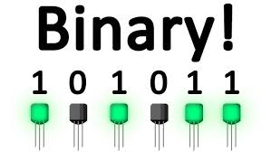
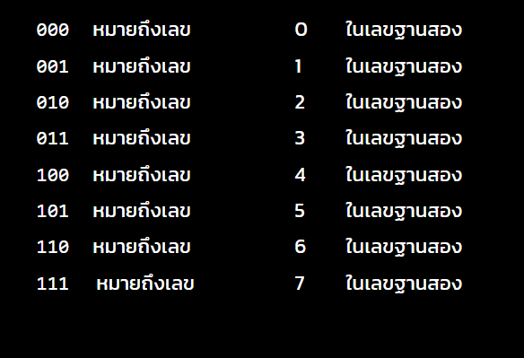
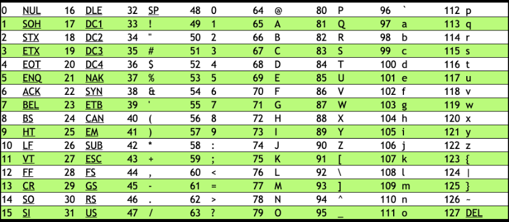
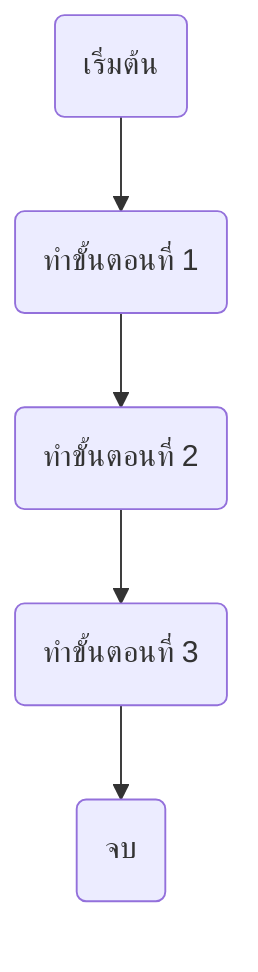
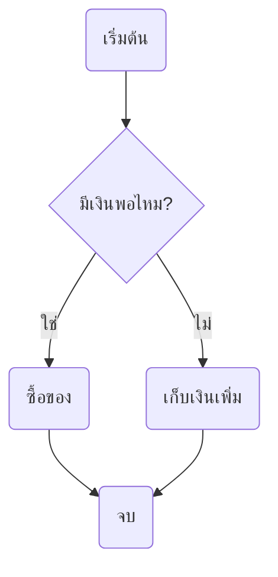
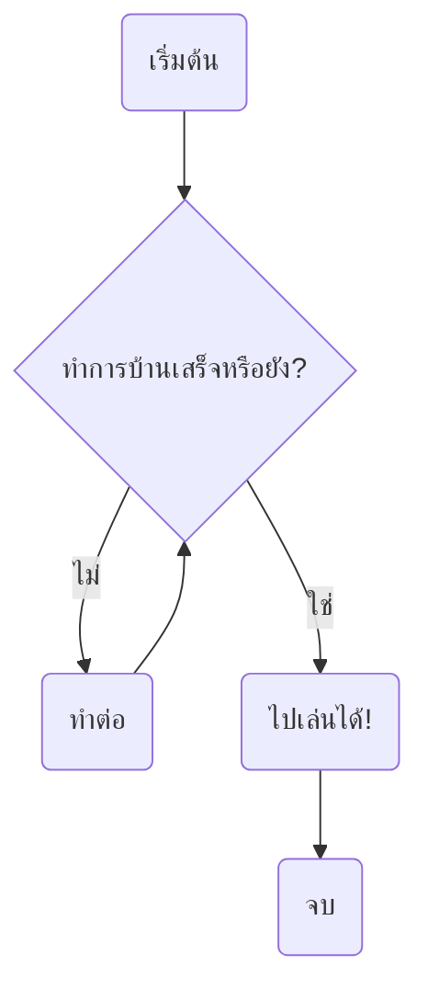

<!-- toc -->

# บทที่ 1: พื้นฐานของคอมพิวเตอร์

## 1. เลข 0 และ 1 คืออะไร?

คอมพิวเตอร์ไม่สามารถเข้าใจภาษาแบบที่มนุษย์พูดได้ มันเข้าใจแค่ **เลข 0 และ 1** เท่านั้น ซึ่งเราเรียกระบบนี้ว่า **เลขฐานสอง (Binary System)**

- **0** หมายถึง ปิด (ไม่มีสัญญาณไฟฟ้า)
- **1** หมายถึง เปิด (มีสัญญาณไฟฟ้า)

<div align="center" >

</div>

ลองนึกถึงสวิตช์ไฟที่มีแค่ "เปิด" และ "ปิด" นั่นแหละคือวิธีที่คอมพิวเตอร์คิด!

## 2. วิธีคำนวณเลขฐานสอง

ตัวเลขที่เราคุ้นเคย (0-9) ใช้ระบบ **เลขฐานสิบ (Decimal)** แต่คอมพิวเตอร์ใช้เลขฐานสองแทน

ตัวอย่างแปลงเลขฐานสิบเป็นฐานสอง:

- **5** → `101` (เพราะ 1×2² + 0×2¹ + 1×2⁰ = 5)
- **8** → `1000`
- **12** → `1100`

<div align="center">



</div>

## 3. บิต (Bit) คืออะไร?

**บิต (Bit) = หน่วยที่เล็กที่สุดของข้อมูล** มีค่าได้แค่ `0` หรือ `1` เท่านั้น

- `8 bits` = **1 ไบต์ (Byte)**
- `1024 Bytes` = **1 กิโลไบต์ (KB)**
- `1024 KB` = **1 เมกะไบต์ (MB)**

## 4. การเข้ารหัสตัวอักษร (Text Encoding)

คอมพิวเตอร์เก็บตัวอักษรเป็นเลขฐานสองผ่าน **ASCII** หรือ **Unicode**

ตัวอย่าง ASCII:

- `A` → `01000001`
- `B` → `01000010`
- `C` → `01000011`

<div align="center">

</div>

## 5. อัลกอริทึมคืออะไร?

**อัลกอริทึม (Algorithm)** คือ ขั้นตอนหรือกฎที่ใช้แก้ปัญหาอย่างเป็นระบบ เหมือนสูตรทำอาหาร!

ตัวอย่าง: วิธีล้างมือ

<div align="center" >

</div>

1. เปิดก๊อกน้ำ
2. เอามือไปล้างน้ำ
3. ใส่สบู่
4. ถูมือให้สะอาด
5. ล้างสบู่ออก
6. ปิดก๊อกน้ำ
7. เช็ดมือให้แห้ง

## 6. โครงสร้างการควบคุมโปรแกรม

**Flowchart** ช่วยแสดงลำดับของขั้นตอนในโปรแกรม เรามีโครงสร้าง 3 แบบหลัก:

### **1. ลำดับ (Sequence)**

<div align="center" >



</div>

### **2. การตัดสินใจ (Decision)**

<div align="center" >



</div>

### **3. การทำซ้ำ (Repetitive)**

<div align="center" >



</div>

## 7. Pseudocode คืออะไร?

**Pseudocode** คือ การเขียนลำดับคำสั่งของโปรแกรมในรูปแบบที่อ่านง่าย เหมือนภาษามนุษย์

ตัวอย่าง: หาค่าเลขมากสุดจากสองตัวเลข

```
BEGIN
  รับค่า A และ B
  ถ้า A > B
    แสดง A
  มิฉะนั้น
    แสดง B
END
```

## แบบทดสอบ

---

## โจทย์ที่ 1: แปลงเลขฐานสิบเป็นเลขฐานสอง ให้คุณแปลงเลขฐานสิบต่อไปนี้เป็นเลขฐานสอง:

```
10 → ?
25 → ?
50 → ?
100 → ?
255 → ?
```

## โจทย์ที่ 2: วาด Flowchart และเขียน Pseudocode ให้คุณออกแบบ Flowchart และเขียน Pseudocode สำหรับโจทย์ต่อไปนี้:

โจทย์:
"เขียนขั้นตอนการตรวจสอบว่าเลขที่รับเข้ามาเป็นเลขคู่หรือเลขคี่ แล้วแสดงผลลัพธ์ออกมา"

[เขียน Flowchart](https://app.diagrams.net/)

ตัวอย่าง Input/Output:

```
รับค่า 8 → แสดงผล "เลขคู่"
รับค่า 15 → แสดงผล "เลขคี่"
```
