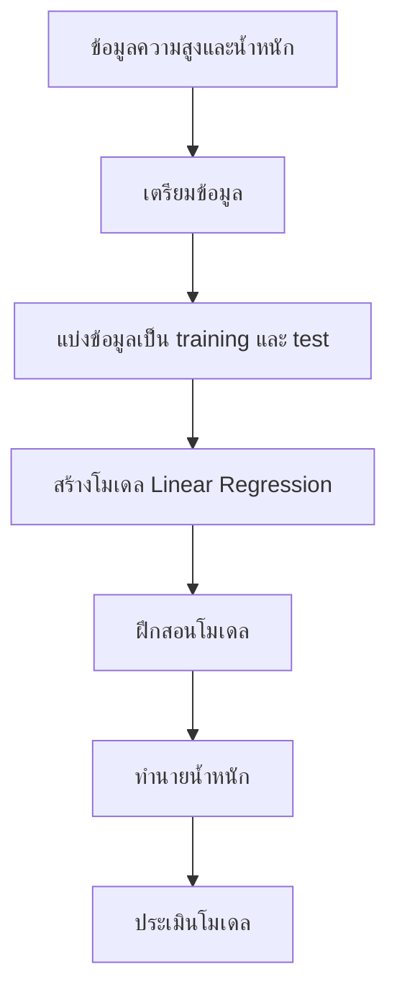

# บทที่ 10: การวิเคราะห์ข้อมูลและการเรียนรู้ของเครื่อง

ในบทนี้ เราจะเรียนรู้เกี่ยวกับการใช้ Python ในการวิเคราะห์ข้อมูลและการเรียนรู้ของเครื่อง โดยใช้ไลบรารี `pandas` และ `scikit-learn` เราจะสร้างโมเดลการเรียนรู้ของเครื่องอย่างง่าย และทดสอบการทำนาย นอกจากนี้เรายังมีโจทย์ให้ลองทำเพื่อฝึกฝนทักษะของคุณ

## 1. การติดตั้งไลบรารี

ก่อนเริ่มต้น เราต้องติดตั้งไลบรารีที่จำเป็นก่อน คุณสามารถติดตั้งได้โดยใช้คำสั่งต่อไปนี้ใน terminal:

```bash
pip install pandas scikit-learn
```

## 2. การนำเข้าไลบรารี

หลังจากติดตั้งไลบรารีแล้ว เราสามารถนำเข้าไลบรารีที่จำเป็นใน Python ได้ดังนี้:

```python
import pandas as pd
from sklearn.model_selection import train_test_split
from sklearn.linear_model import LinearRegression
from sklearn.metrics import mean_squared_error
```

## 3. การโหลดข้อมูล

เราจะใช้ข้อมูลตัวอย่างง่ายๆ เพื่อการเรียนรู้ ในที่นี้เราจะใช้ข้อมูลเกี่ยวกับความสูงและน้ำหนักของเด็กอนุบาล

```python
data = {
    'Height (cm)': [120, 130, 140, 150, 160],
    'Weight (kg)': [22, 28, 35, 42, 50]
}
df = pd.DataFrame(data)
```

## 4. การเตรียมข้อมูล

เราจะแบ่งข้อมูลออกเป็นสองส่วน: ข้อมูลฝึกสอน (training data) และข้อมูลทดสอบ (test data)

```python
X = df[['Height (cm)']]
y = df['Weight (kg)']
X_train, X_test, y_train, y_test = train_test_split(X, y, test_size=0.2, random_state=42)
```

## 5. การสร้างโมเดล

เราจะใช้โมเดล Linear Regression ใช้ในการทำนายตัวแปรเชิงปริมาณ เพื่อทำนายน้ำหนักจากความสูง

```python
model = LinearRegression()
model.fit(X_train, y_train)
```

แต่ก็ยังมีอื่นๆด้วยเช่น

<details>
  <summary>Decision Tree:</summary>

- Decision Tree เป็นโมเดลที่ใช้การแบ่งข้อมูลออกเป็นส่วนๆ ตามเงื่อนไขของฟีเจอร์ต่างๆ เหมาะสำหรับปัญหาทั้งการจำแนกประเภท (Classification) และการทำนายค่า (Regression) ใช้ในการตัดสินใจในงานธุรกิจหรือการประเมินคุณสมบัติ เช่น การเลือกสินค้าหรือการคัดกรองลูกค้าที่มีแนวโน้มในการซื้อ

```python
from sklearn.tree import DecisionTreeRegressor

# สร้างโมเดล Decision Tree
tree_model = DecisionTreeRegressor()
tree_model.fit(X_train, y_train)

# ทำนาย
y_pred = tree_model.predict(X_test)
```

</details>

<details>
  <summary>Random Forest:</summary>

- Random Forest เป็นโมเดลที่รวม Decision Tree หลายๆ ต้นเข้าด้วยกัน เพื่อลดโอกาส Overfitting และเพิ่มความแม่นยำ ใช้ในงานที่ต้องการลดความผิดพลาดจากการตัดสินใจเพียงครั้งเดียว เช่น การคาดการณ์ผลการเลือกตั้งหรือการทำนายโรคจากอาการต่างๆ

```python
from sklearn.ensemble import RandomForestRegressor

# สร้างโมเดล Random Forest
forest_model = RandomForestRegressor(n_estimators=100)  # n_estimators คือจำนวนต้นไม้
forest_model.fit(X_train, y_train)

# ทำนาย
y_pred = forest_model.predict(X_test)
```

</details>

<details>
  <summary>SVM (Support Vector Machine):</summary>

- SVM เป็นโมเดลที่ใช้สำหรับการจำแนกประเภท (Classification) และการทำนายค่า (Regression) โดยการหาขอบเขตที่เหมาะสมที่สุดเพื่อแยกข้อมูลออกจากกัน ใช้ในการจำแนกประเภท เช่น การจำแนกอีเมลเป็นสแปมหรือไม่สแปม หรือการตรวจจับวัตถุในภาพ

```python
from sklearn.svm import SVR

# สร้างโมเดล SVM
svm_model = SVR(kernel='linear')  # kernel สามารถเป็น 'linear', 'rbf', 'poly' ได้
svm_model.fit(X_train, y_train)

# ทำนาย
y_pred = svm_model.predict(X_test)
```

</details>
<details>
  <summary>K-Nearest Neighbors (KNN):</summary>

- KNN เป็นโมเดลที่ใช้หลักการ "เพื่อนบ้านใกล้ที่สุด" โดยการทำนายค่าจากค่าเฉลี่ยของจุดข้อมูลที่ใกล้เคียงที่สุด ใช้ในการจำแนกประเภทหรือทำนายค่าตัวแปร เช่น การทำนายผลการศึกษา หรือแนะนำสินค้าตามความชอบของลูกค้า

```python
from sklearn.neighbors import KNeighborsRegressor

# สร้างโมเดล KNN
knn_model = KNeighborsRegressor(n_neighbors=5)  # n_neighbors คือจำนวนเพื่อนบ้าน
knn_model.fit(X_train, y_train)

# ทำนาย
y_pred = knn_model.predict(X_test)
```

</details>
<details>
  <summary>Neural Networks:</summary>

- Neural Networks เป็นโมเดลที่เลียนแบบการทำงานของสมองมนุษย์ โดยใช้เลเยอร์ของโหนด (Neurons) หลายชั้น เหมาะสำหรับปัญหาที่ซับซ้อน ใช้ในงานที่ซับซ้อน เช่น การจดจำใบหน้า, การแปลภาษาอัตโนมัติ

```python
from sklearn.neural_network import MLPRegressor

# สร้างโมเดล Neural Network
nn_model = MLPRegressor(hidden_layer_sizes=(10, 10), max_iter=1000)  # hidden_layer_sizes คือจำนวนโหนดในแต่ละเลเยอร์
nn_model.fit(X_train, y_train)

# ทำนาย
y_pred = nn_model.predict(X_test)
```

</details>
<details>
  <summary>Gradient Boosting:</summary>

- Gradient Boosting เป็นโมเดลที่รวม Decision Tree หลายๆ ต้นเข้าด้วยกัน โดยการปรับปรุงความผิดพลาดทีละขั้นตอน ใช้ในการปรับปรุงโมเดลที่มีความแม่นยำน้อย เช่น การคาดการณ์พฤติกรรมของลูกค้าหรือการประเมินความเสี่ยงทางการเงิน

```python
from sklearn.ensemble import GradientBoostingRegressor

# สร้างโมเดล Gradient Boosting
gb_model = GradientBoostingRegressor(n_estimators=100, learning_rate=0.1)
gb_model.fit(X_train, y_train)

# ทำนาย
y_pred = gb_model.predict(X_test)
```

</details>

## 6. การทดสอบโมเดล

หลังจากที่โมเดลถูกฝึกสอนแล้ว เราสามารถใช้โมเดลนี้เพื่อทำนายน้ำหนักจากความสูงได้

```python
y_pred = model.predict(X_test)
print(y_pred)
```

## 7. การประเมินโมเดล

เราสามารถประเมินประสิทธิภาพของโมเดลโดยใช้ค่า Mean Squared Error (MSE)

- MSE ต่ำ: แปลว่าโมเดลทำนายได้ใกล้เคียงกับค่าจริงมาก (ประสิทธิภาพดี)
- MSE สูง: แปลว่าโมเดลทำนายได้ห่างจากค่าจริงมาก (ประสิทธิภาพไม่ดี)
- ค่า MSE เป็นเพียงหนึ่งในหลายตัวชี้วัดประสิทธิภาพของโมเดล เรายังสามารถใช้ตัวชี้วัดอื่นๆ เช่น R-squared, MAE (Mean Absolute Error), หรือ RMSE (Root Mean Squared Error) ได้อีกด้วย

```python
mse = mean_squared_error(y_test, y_pred)
print(f'Mean Squared Error: {mse}')
```

## 8. แผนภาพการทำงานของโมเดล

เราสามารถใช้ Mermaid เพื่อสร้างแผนภาพการทำงานของโมเดลได้ดังนี้:



## 9. ทำนายด้วยข้อมูลใหม่

```python
new_heights = [[125], [145], [155]]  # ต้องอยู่ในรูปแบบของลิสต์ 2 มิติ

predicted_weights = model.predict(new_heights)

for height, weight in zip(new_heights, predicted_weights):
    print(f"ความสูง {height[0]} cm ทำนายน้ำหนัก {weight:.2f} kg")
```

## ตัวอย่างโค้ด

- [machine-learning.zip](assets/machine-learning.zip)

## **โจทย์ท้ายบท**

1. **โจทย์ที่ 1:** ลองเปลี่ยนข้อมูลความสูงและน้ำหนักเป็นข้อมูลของคุณเอง และทำนายน้ำหนักของคุณจากความสูงที่คุณป้อนเข้าไป

2. **โจทย์ที่ 2:** ลองใช้ข้อมูลอื่นๆ เช่น อายุและน้ำหนัก เพื่อทำนายความสูง

3. **โจทย์ที่ 3:** ลองเปลี่ยนโมเดลจาก Linear Regression เป็น Decision Tree และเปรียบเทียบผลลัพธ์

4. **โจทย์ที่ 4:** ลองเพิ่มคอลัมน์ข้อมูลใหม่ เช่น เพศ และดูว่ามีผลต่อการทำนายน้ำหนักหรือไม่

5. **โจทย์ที่ 5:** ลองใช้ข้อมูลจากไฟล์ CSV แทนการป้อนข้อมูลด้วยมือ และทำนายน้ำหนักจากความสูง
