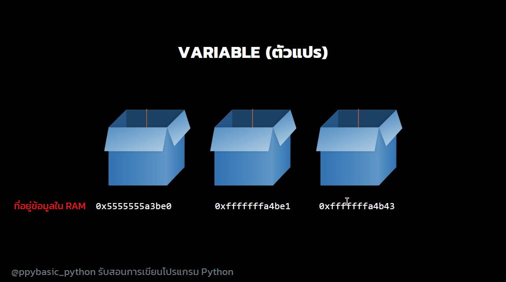

<!-- toc -->

# บทที่ 2: พื้นฐานของ Python

## 1. ตัวแปรคืออะไร?

ตัวแปร (Variable) คือ **กล่อง** ที่ใช้เก็บข้อมูลในโปรแกรม ลองนึกถึงการใส่ของลงในกล่อง เช่น:

```python
name = "Alice"
age = 10
```

- ตัวแปร `name` เก็บคำว่า "Alice"
- ตัวแปร `age` เก็บเลข 10

เหมือนกล่องที่ติดป้ายชื่อไว้ ว่าในกล่องมีอะไรอยู่!

<div align="center" >

</div>

## 2. กฎการตั้งชื่อตัวแปร

1. ต้องเริ่มต้นด้วยตัวอักษร หรือ `_`
2. ห้ามใช้ตัวเลขนำหน้า
3. ห้ามใช้คำสงวน เช่น `if, while, for`
4. ควรตั้งชื่อให้สื่อความหมาย
5. ส่วนใหญ่ใช้ตัวพิมพ์เล็กเป็นชื่อตัวแปร ยกเว้น `class`

ตัวอย่างที่ถูกต้อง ✅:

```python
user_name = "Bob"
count = 5
_speed = 20.5
```

ตัวอย่างที่ผิด ❌:

```python
1name = "Bob"  # ❌ ผิด เพราะขึ้นต้นด้วยตัวเลข
if = 5         # ❌ ผิด เพราะใช้คำสงวน
```

## 3. ชนิดของตัวแปรใน Python

Python มีหลายประเภท เช่น:

| ชนิดข้อมูล | คำอธิบาย                                                             | ตัวอย่าง                         |
| ---------- | -------------------------------------------------------------------- | -------------------------------- |
| `int`      | ตัวเลขจำนวนเต็ม                                                      | `10, -5, 1000`                   |
| `float`    | ตัวเลขทศนิยม                                                         | `3.14, -2.5, 0.0`                |
| `str`      | ข้อความ                                                              | `"Hello", 'Python'`              |
| `bool`     | ค่า True/False                                                       | `True, False`                    |
| `list`     | กลุ่มข้อมูล (ใช้สําหรับเก็บค่าหลายค่าในตัวแปรเดียว)                  | `[1, 2, 3]`                      |
| `dict`     | ตารางข้อมูล (ใช้สําหรับเก็บค่าไม่ซ้ําที่มีความสัมพันธ์แบบ key-value) | `{ "name": "Alice", "age": 10 }` |
| `tuple`    | กลุ่มข้อมูล (ใช้สำหรับไม่ต้องการแก้ไขข้อมูล)                         | `(1, 2, 3)`                      |
| `set`      | กลุ่มข้อมูล (ใช้สําหรับเก็บค่าไม่ซ้ํา)                               | `{1, 2, 3}`                      |

**ตัวอย่างการประกาศตัวแปรแบบกำหนดชนิดข้อมูล**:

```python
age: int = 10
price: float = 99.99
message: str = "Hello"
is_student: bool = True
list_of_numbers: list = [1, 2, 3]
movie_info: dict = {"title": "The Matrix", "year": 1999}
coordinates: tuple = (1.0, 1.0)
x, y, z: float = 1.0, 2.0, 3.0
set_of_numbers: set = {1, 2, 3}
```

## 4. ฟังก์ชันใน Python

**ฟังก์ชัน** คือ **กล่องที่ใส่คำสั่งไว้ใช้งานซ้ำๆ** สามารถรับค่าและส่งค่าไปยังฟังก์ชันอื่นได้ อีกจุดประสงค์นึงคือ **ใช้การควบคุมโค้ด** กรณีโค้ดยาวเกินไป สามารถใช้ฟังก์ชันเพื่อย่อโค้ดได้

ตัวอย่างฟังก์ชันหาผลรวมของตัวเลข:

```python
def add_numbers(a, b):
    return a + b

print(add_numbers(3, 5))  # แสดงผล 8
```

## 5. ตรวจสอบชนิดข้อมูล

Python มีฟังก์ชัน `type()` เพื่อตรวจสอบชนิดข้อมูล

```python
print(type(10))      # <class 'int'>
print(type("hello")) # <class 'str'>
```

**ทำไมต้องตรวจสอบชนิดข้อมูล?**

- เพื่อป้องกันข้อผิดพลาด เช่น การนำตัวเลขไปบวกกับข้อความ

## 6. การแปลงชนิดข้อมูล

Python สามารถแปลงชนิดข้อมูลได้ เช่น:

```python
num_str = "123"
num_int = int(num_str)  # แปลงเป็นจำนวนเต็ม
print(num_int + 10)  # แสดงผล 133
```

**สิ่งที่แปลงไม่ได้:**

```python
int("hello")  # ❌ Error เพราะ "hello" ไม่ใช่ตัวเลข
float("text")  # ❌ Error เพราะ "text" ไม่ใช่ตัวเลข
```

## 7. การแสดงผลข้อมูลผ่าน Console

ใช้ `print()`

```python
print("Hello, World!")
```

## 8. รับค่าจากคีย์บอร์ด

ใช้คำสั่ง `input()`

```python
name = input("กรุณาใส่ชื่อของคุณ: ")
print("สวัสดี", name)
```

## 9. การต่อสตริง

```python
first_name = "John"
last_name = "Doe"
full_name = first_name + " " + last_name
print(full_name)  # John Doe
```

อีกแบบก็คือ

```python
first_name = "John"
last_name = "Doe"
full_name = f"{first_name} {last_name}"
print(full_name)  # John Doe
```

หรืออีกแบบ

```python
first_name = "John"
last_name = "Doe"
full_name = "{} {}".format(first_name, last_name)
print(full_name)  # John Doe
```

## 10. คอมเมนต์ใน Python

- **คอมเมนต์** ใช้เครื่องหมาย `#`
- ช่วยให้โค้ดอ่านง่าย อะไรที่อยู่หลัง `#` จะไม่ถูกโปรแกรมรัน
- ส่วนใหญ่จะใช้ในการแสดงคําแนะนํา หรือโน๊ตข้อความทิ้งไว้ เพื่ออ้างอิงในอนาคต กรณีลืม

```python
# นี่คือคอมเมนต์
print("Hello")  # คำสั่งแสดงผล
```

## **โจทย์ท้ายบท**

1. สร้างตัวแปรชื่อ `age` และกำหนดค่าเป็น `25`
2. เขียนฟังก์ชันที่รับชื่อและอายุ และแสดงผล `"สวัสดี [ชื่อ] อายุ [อายุ] ปี"`
3. ตรวจสอบชนิดข้อมูลของตัวแปร `5.5` และ `"Python"`
4. รับค่าตัวเลขจากคีย์บอร์ด และบวกเพิ่ม `10` ก่อนแสดงผล
5. แปลงตัวเลข `100` เป็นข้อความ แล้วต่อกับ `" คะแนน"` และแสดงผล
