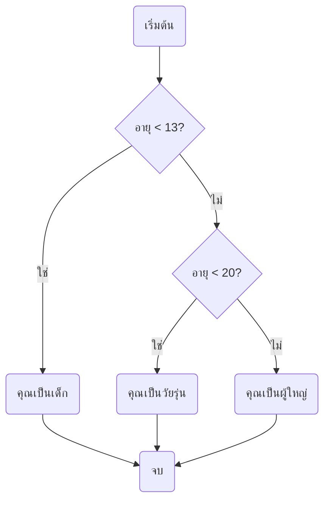
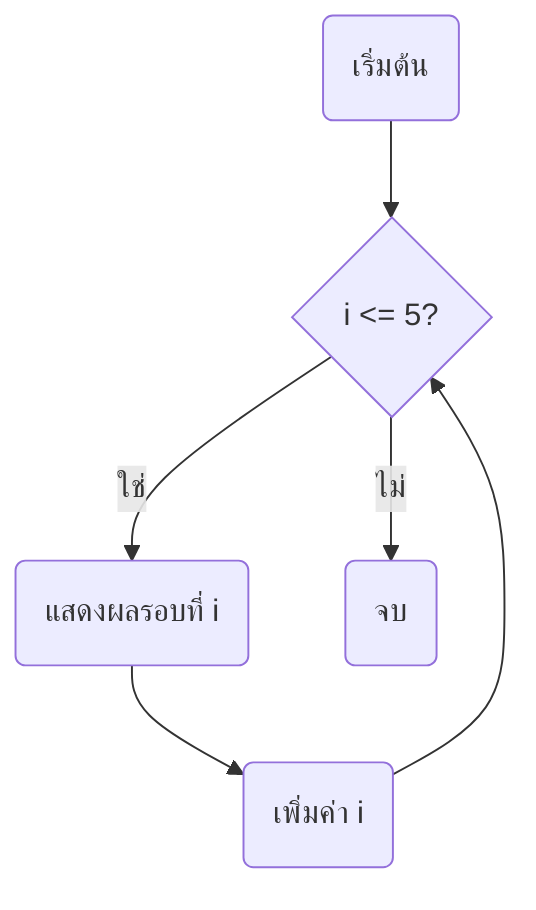
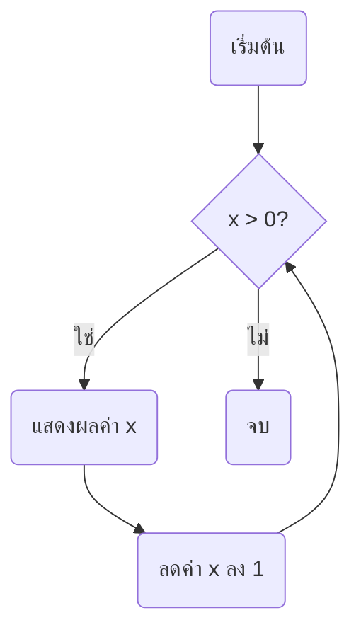

<!-- toc -->

# บทที่ 3: ตัวดำเนินการและการควบคุมการไหลของโปรแกรม

## 1. ตัวดำเนินการทางคณิตศาสตร์

ตัวดำเนินการทางคณิตศาสตร์ใน Python ใช้สำหรับคำนวณค่าต่าง ๆ เช่น การบวก ลบ คูณ หาร เป็นต้น

| ตัวดำเนินการ | คำอธิบาย       | ตัวอย่าง            |
| ------------ | -------------- | ------------------- |
| `+`          | บวก            | `3 + 2  # ได้ 5`    |
| `-`          | ลบ             | `7 - 4  # ได้ 3`    |
| `*`          | คูณ            | `5 * 3  # ได้ 15`   |
| `/`          | หาร            | `10 / 2  # ได้ 5.0` |
| `//`         | หารแบบปัดเศษลง | `10 // 3  # ได้ 3`  |
| `%`          | หารเอาเศษ      | `10 % 3  # ได้ 1`   |
| `**`         | ยกกำลัง        | `2 ** 3  # ได้ 8`   |

## 2. ตัวดำเนินการเปรียบเทียบ

ตัวดำเนินการเปรียบเทียบใช้สำหรับตรวจสอบค่าระหว่างตัวแปรว่ามีความสัมพันธ์กันอย่างไร เช่น มากกว่า น้อยกว่า เท่ากัน หรือไม่เท่ากัน เป็นต้น

| ตัวดำเนินการ | คำอธิบาย            | ตัวอย่าง             |
| ------------ | ------------------- | -------------------- |
| `==`         | เท่ากับ             | `5 == 5  # ได้ True` |
| `!=`         | ไม่เท่ากับ          | `5 != 3  # ได้ True` |
| `>`          | มากกว่า             | `5 > 3  # ได้ True`  |
| `<`          | น้อยกว่า            | `2 < 7  # ได้ True`  |
| `>=`         | มากกว่าหรือเท่ากับ  | `5 >= 5  # ได้ True` |
| `<=`         | น้อยกว่าหรือเท่ากับ | `3 <= 5  # ได้ True` |

## 3. กฎพื้นฐานลำดับการดำเนินการ

Python ใช้กฎ PEMDAS (Parentheses, Exponents, Multiplication/Division, Addition/Subtraction) ในการคำนวณ

1. ดำเนินการในวงเล็บก่อน จากซ้ายไปขวา
2. เลขยกกำลัง และ √ จากซ้ายไปขวา
3. การคูณ และ หาร จากซ้ายไปขวา
4. การบวก และ การลบ จากซ้ายไปขวา

**ตัวอย่าง:**

```python
result = (2 + 3) * 4 / 2 ** 2
print(result)  # ได้ 5.0
```

## 4. การควบคุมการไหลของโปรแกรม

### 4.1 คำสั่ง `if`, `elif`, `else`

ใช้สำหรับให้โปรแกรมตัดสินใจตามเงื่อนไข

```python
age = 10
if age < 13:
    print("คุณเป็นเด็ก")
elif age < 20:
    print("คุณเป็นวัยรุ่น")
else:
    print("คุณเป็นผู้ใหญ่")
```



### 4.2 ลูป `for`

ใช้สำหรับทำซ้ำตามจำนวนครั้งที่กำหนด

```python
for i in range(1, 6):
    print("รอบที่", i)
```



### 4.3 ลูป `while`

ใช้สำหรับทำซ้ำจนกว่าเงื่อนไขจะเป็น `False`

```python
x = 3
while x > 0:
    print("ค่า x:", x)
    x -= 1
```



## **โจทย์ท้ายบท**

1. เขียนโปรแกรมรับเลขสองตัวจากผู้ใช้ แล้วแสดงผลว่าตัวไหนมากกว่ากัน
2. สร้างโปรแกรมที่รับอายุจากผู้ใช้ และบอกว่าผู้ใช้อยู่ในช่วงวัยไหน (เด็ก, วัยรุ่น, ผู้ใหญ่)
3. เขียนโปรแกรมคำนวณหาผลรวมของตัวเลขตั้งแต่ 1 ถึง 10 ด้วยลูป `for`
4. ใช้ `while` loop เพื่อให้ผู้ใช้ป้อนตัวเลข จนกว่าจะป้อนเลข 0
5. เขียนโปรแกรมใช้ `if` และ `for` เพื่อแสดงเลขคู่ตั้งแต่ 1 ถึง 20
