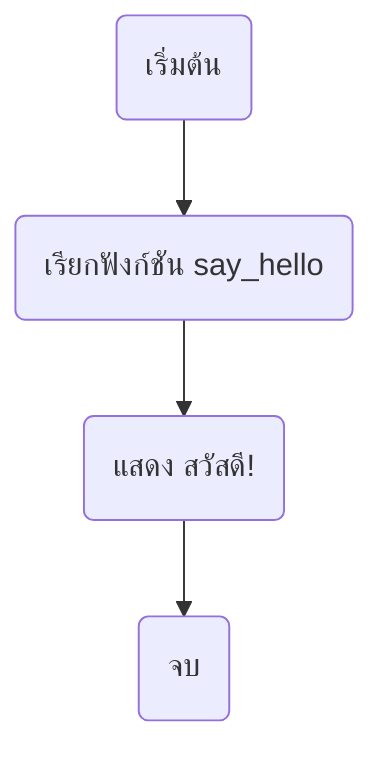
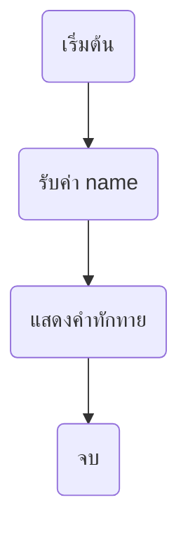
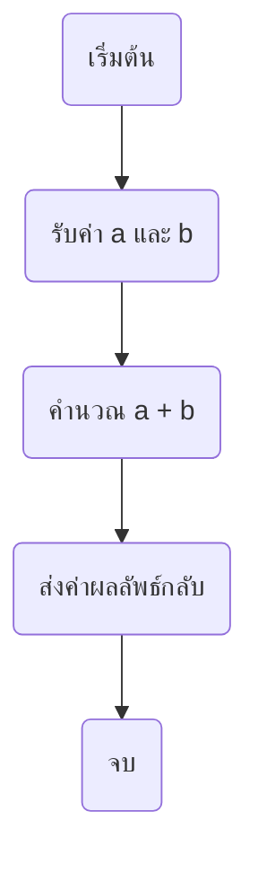
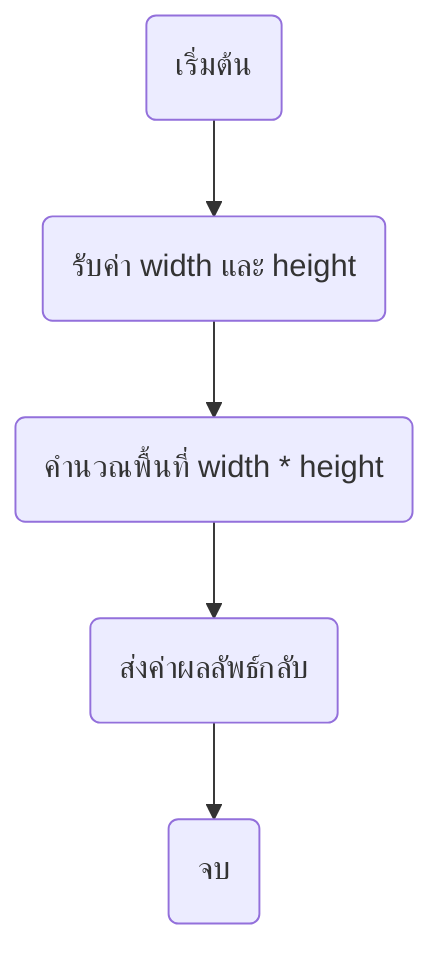
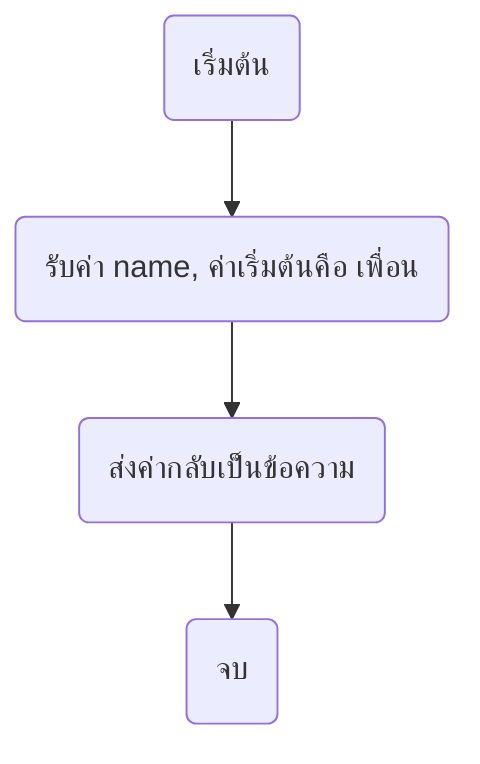
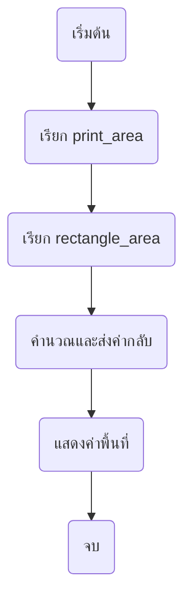

<!-- toc -->

# บทที่ 4: ฟังก์ชันและการนำโค้ดกลับมาใช้ใหม่

## 1. ฟังก์ชันคืออะไร?

ฟังก์ชัน (Function) คือ **กลุ่มของคำสั่ง** ที่ถูกจัดไว้เป็นส่วนๆ เพื่อให้สามารถเรียกใช้งานซ้ำได้ ช่วยให้โค้ดอ่านง่าย และลดการเขียนซ้ำ

### ตัวอย่างโค้ดฟังก์ชันง่ายๆ:

```python
# ฟังก์ชันแสดงคำทักทาย
def say_hello():
    print("สวัสดี!")

say_hello()
```

### แผนภาพแสดงการเรียกใช้ฟังก์ชัน



## 2. การแบ่งโค้ดเป็นส่วนเล็กๆ

### ตัวอย่าง:

```python
def greet(name):
    print(f"สวัสดี {name}!")

greet("เด็กอนุบาล")
greet("นักเรียน")
```



## 3. ฟังก์ชันที่สามารถนำกลับมาใช้ใหม่

### ตัวอย่าง:

```python
def add(a, b):
    return a + b

result = add(5, 3)
print(result)
```



## 4. ฟังก์ชันคำนวณพื้นที่ของรูปทรงต่างๆ

### ตัวอย่าง: คำนวณพื้นที่สี่เหลี่ยมผืนผ้า

```python
def rectangle_area(width, height):
    return width * height

print(rectangle_area(5, 10))
```



## 5. Parameter และ Return Value ของฟังก์ชัน

### ตัวอย่าง:

```python
def greet(name="เพื่อน"):  # ค่าเริ่มต้น
    return f"สวัสดี {name}!"

print(greet())
print(greet("เด็กอนุบาล"))
```



## 6. ใช้ฟังก์ชันหลายๆ ฟังก์ชันร่วมกัน

### ตัวอย่าง: โปรแกรมคำนวณพื้นที่สี่เหลี่ยมแล้วพิมพ์ผลลัพธ์

```python
def rectangle_area(width, height):
    return width * height

def print_area(width, height):
    area = rectangle_area(width, height)
    print(f"พื้นที่คือ: {area} ตารางหน่วย")

print_area(4, 6)
```



## 7. Lambda Function

`lambda function` หรือ **Anonymous Function** เป็นฟังก์ชันที่ไม่มีชื่อ ใช้ในกรณีที่ต้องการฟังก์ชันแบบสั้นๆ และใช้งานเพียงครั้งเดียว

### โครงสร้างของ `lambda function`

```python
lambda parameters: expression
```

### ตัวอย่างการใช้งาน

```python
# ฟังก์ชันปกติ
def square(x):
    return x * x

print(square(5))  # 25

# ใช้ lambda function
square_lambda = lambda x: x * x
print(square_lambda(5))  # 25
```

### ตัวอย่างการใช้กับ `map()`, `filter()`, และ `sorted()`

```python
numbers = [1, 2, 3, 4, 5]

# ใช้ map() กับ lambda
squared_numbers = list(map(lambda x: x * x, numbers))
print(squared_numbers)  # [1, 4, 9, 16, 25]

# ใช้ filter() กับ lambda
even_numbers = list(filter(lambda x: x % 2 == 0, numbers))
print(even_numbers)  # [2, 4]

# ใช้ sorted() กับ lambda
words = ["apple", "banana", "cherry"]
sorted_words = sorted(words, key=lambda word: len(word))
print(sorted_words)  # ['apple', 'cherry', 'banana']
```

## **โจทย์ท้ายบท**

1. **คำนวณพื้นที่วงกลม**: เขียนฟังก์ชัน `circle_area(radius)` เพื่อคำนวณพื้นที่วงกลม

   - สูตร: `pi = 3.14`

2. **ตรวจสอบเลขคู่**: เขียนฟังก์ชัน `is_even(number)` เพื่อตรวจสอบว่าเป็นเลขคู่หรือไม่

   - เงื่อนไข: ถ้า `number % 2 == 0` ให้คืนค่า `True` ไม่เช่นนั้นคืนค่า `False`

3. **แปลงอุณหภูมิ**: เขียนฟังก์ชัน `convert_celsius_to_fahrenheit(celsius)` เพื่อแปลงอุณหภูมิจากเซลเซียสเป็นฟาเรนไฮต์

   - สูตร: `F = (C x 9/5) + 32`

4. **หาค่ามากที่สุด**: เขียนฟังก์ชัน `max_of_three(a, b, c)` หาค่ามากที่สุดในสามจำนวน

   - ใช้เงื่อนไข `if-elif-else` เพื่อเปรียบเทียบค่าทั้งสาม

5. **สร้างสามเหลี่ยมดาว**: เขียนฟังก์ชัน `print_triangle(n)` เพื่อพิมพ์สามเหลี่ยมดาว (`*`) ขนาด `n` แถว

   - ใช้ `for` loop เพื่อสร้างแต่ละแถวของสามเหลี่ยม
