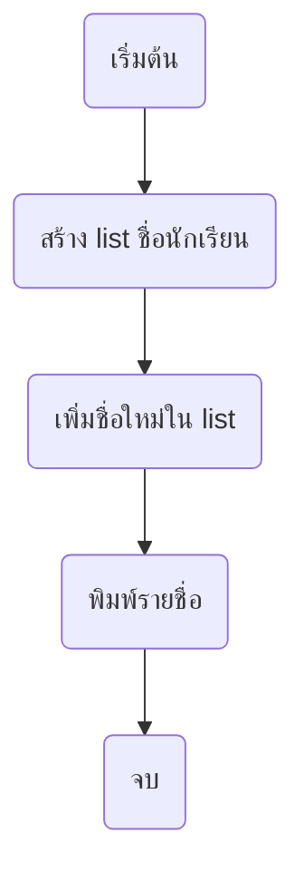
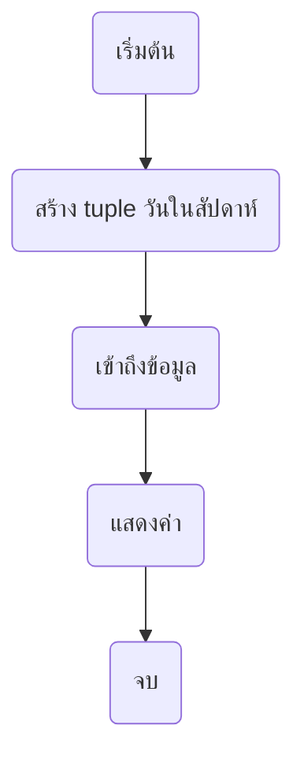
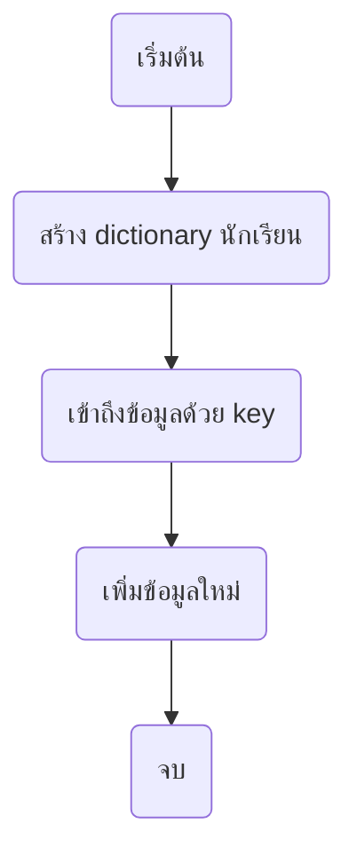
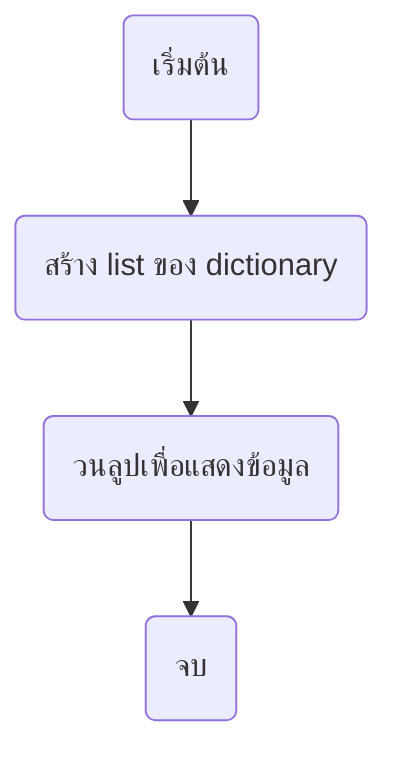
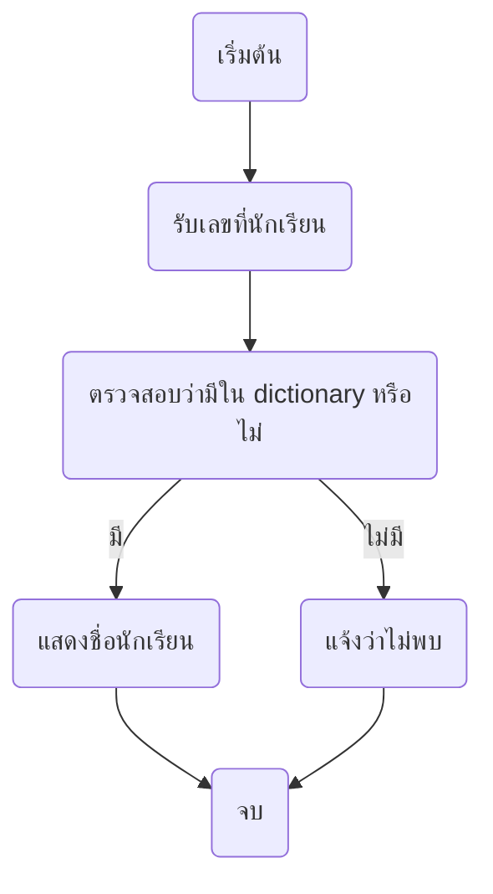

<!-- toc -->

# บทที่ 5: โครงสร้างข้อมูลใน Python

## 1. โครงสร้างข้อมูลคืออะไร?

โครงสร้างข้อมูล (Data Structures) คือ **วิธีการจัดเก็บและจัดการข้อมูล** ในโปรแกรมให้สามารถเรียกใช้ได้ง่ายขึ้น ในภาษา Python มีโครงสร้างข้อมูลที่สำคัญ เช่น `list`, `tuple`, และ `dictionary`

## 2. List (รายการ)

`list` เป็น **กลุ่มของข้อมูลที่สามารถเปลี่ยนแปลงได้** และสามารถเก็บข้อมูลได้หลายประเภทในรายการเดียวกัน

### ตัวอย่างการใช้ `list`

```python
# รายชื่อนักเรียน
students = ["เอ", "บี", "ซี", "ดี"]

# เข้าถึงข้อมูลใน list
print(students[0])  # "เอ"
print(students[2])  # "ซี"

# เพิ่มข้อมูล
students.append("อี")
print(students)  # ["เอ", "บี", "ซี", "ดี", "อี"]
```



## 3. Tuple (กลุ่มข้อมูลที่ไม่เปลี่ยนแปลง)

`tuple` คล้ายกับ `list` แต่ **ไม่สามารถเปลี่ยนแปลงค่าได้** เหมาะสำหรับข้อมูลที่ต้องการให้คงที่

### ตัวอย่างการใช้ `tuple`

```python
# วันในสัปดาห์ (ไม่เปลี่ยนแปลง)
days = ("จันทร์", "อังคาร", "พุธ", "พฤหัสบดี", "ศุกร์", "เสาร์", "อาทิตย์")

# เข้าถึงข้อมูล
print(days[0])  # "จันทร์"
print(days[-1]) # "อาทิตย์"
```



## 4. Dictionary (พจนานุกรมข้อมูล)

`dictionary` ใช้ **คู่ของคีย์ (key) และค่า (value)** เพื่อเก็บข้อมูล

### ตัวอย่างการใช้ `dictionary`

```python
# เก็บข้อมูลนักเรียน (เลขที่ -> ชื่อ)
students = {
    1: "เอ",
    2: "บี",
    3: "ซี",
    4: "ดี"
}

# เข้าถึงข้อมูล
print(students[2])  # "บี"

# เพิ่มข้อมูล
students[5] = "อี"
print(students)
```



## 5. โปรแกรมเก็บข้อมูลนักเรียนใน `dictionary` และ `list`

```python
students = [
    {"เลขที่": 1, "ชื่อ": "เอ", "เกรด": 3.5},
    {"เลขที่": 2, "ชื่อ": "บี", "เกรด": 3.8},
    {"เลขที่": 3, "ชื่อ": "ซี", "เกรด": 4.0}
]

# แสดงข้อมูล
for student in students:
    print(f"เลขที่ {student['เลขที่']}: {student['ชื่อ']} - เกรด {student['เกรด']}")
```



## 6. โปรแกรมค้นหาชื่อนักเรียนจากเลขที่

```python
students = {
    1: "เอ",
    2: "บี",
    3: "ซี",
    4: "ดี"
}

# รับเลขที่จากผู้ใช้
num = int(input("กรุณาใส่เลขที่นักเรียน: "))

# ค้นหานักเรียน
if num in students:
    print(f"นักเรียนเลขที่ {num} คือ {students[num]}")
else:
    print("ไม่พบนักเรียน")
```



## **โจทย์ท้ายบท**

1. **สร้าง `list` ของผลไม้** ที่มี "กล้วย", "แอปเปิล", "ส้ม" และเพิ่ม "มะม่วง" ลงไป แล้วพิมพ์ผลลัพธ์
2. **เขียน `tuple` ของสีรุ้ง** ที่ประกอบด้วยสี 7 สี แล้วพิมพ์สีที่อยู่ตำแหน่งที่ 3
3. **สร้าง `dictionary` ของคะแนนสอบ** โดยมีนักเรียน 3 คน (ใช้เลขที่เป็น key และคะแนนเป็น value) แล้วเพิ่มนักเรียนใหม่เข้าไป
4. **เขียนโปรแกรมที่รับเลขที่นักเรียน** แล้วแสดงชื่อของนักเรียนคนนั้น (ใช้ `dictionary`)
5. **เขียนโปรแกรมที่รับค่าชื่อจากผู้ใช้** แล้วตรวจสอบว่ามีอยู่ใน `list` หรือไม่ ถ้ามีให้พิมพ์ "พบชื่อนี้" ถ้าไม่มีให้พิมพ์ "ไม่พบชื่อนี้"
