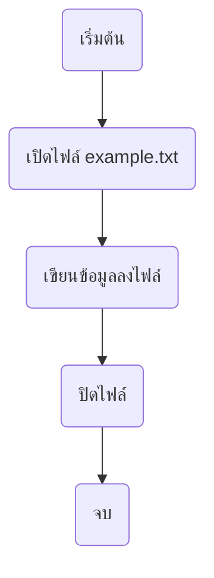
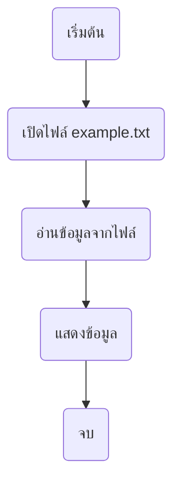
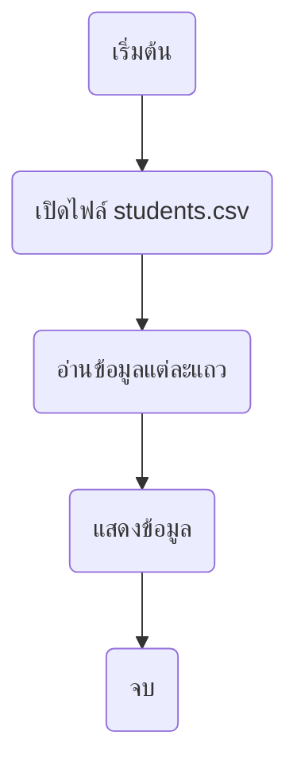
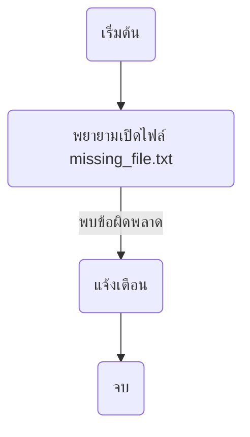
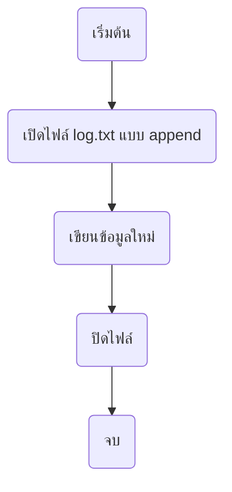

# บทที่ 6: การจัดการไฟล์ใน Python

## 1. การอ่านและเขียนไฟล์ใน Python

ไฟล์เป็นสิ่งที่ช่วยให้เราสามารถบันทึกข้อมูลและนำกลับมาใช้ใหม่ได้ Python มีฟังก์ชันสำหรับจัดการไฟล์ได้ง่ายๆ

### ตัวอย่างการเขียนไฟล์

```python
# เปิดไฟล์เพื่อเขียนข้อมูล
with open("example.txt", "w") as file:
    file.write("สวัสดี Python!")
```



### ตัวอย่างการอ่านไฟล์

```python
# เปิดไฟล์เพื่ออ่านข้อมูล
with open("example.txt", "r") as file:
    content = file.read()
    print(content)
```



---

## 2. การอ่านข้อมูลจากไฟล์ CSV และนำมาประมวลผล

### ตัวอย่างการอ่าน CSV

ตัวอย่างไฟล์ [`students.csv`](./assets/students.csv)

```python
import csv

with open("students.csv", "r") as file:
    reader = csv.reader(file)
    for row in reader:
        print(row)
```



---

## 3. การจัดการข้อผิดพลาดในการทำงานกับไฟล์

### ตัวอย่างการจัดการข้อผิดพลาด

```python
try:
    with open("missing_file.txt", "r") as file:
        content = file.read()
except FileNotFoundError:
    print("ไม่พบไฟล์ที่ระบุ")
```



---

## 4. เขียนโปรแกรมที่บันทึกข้อมูลลงในไฟล์

### ตัวอย่างการบันทึกข้อมูล

```python
with open("log.txt", "a") as file:
    file.write("บันทึกข้อมูลใหม่\n")
```



---

## **โจทย์ท้ายบท**

1. เขียนโปรแกรมที่อ่านไฟล์ [data.txt](./assets/data.txt) แล้วแสดงเนื้อหาในไฟล์
2. เขียนโปรแกรมที่สร้างไฟล์ `output.txt` และเขียนข้อความ "Hello, Python!" ลงไป
3. เขียนโปรแกรมที่อ่านไฟล์ CSV [students.csv](./assets/students.csv) และแสดงเฉพาะชื่อของนักเรียน
4. เขียนโปรแกรมที่บันทึกบันทึกคะแนนนักเรียนลงในไฟล์ `scores.txt`
5. เขียนโปรแกรมที่ตรวจสอบว่าไฟล์ `config.txt` มีอยู่หรือไม่ และแจ้งเตือนหากไม่พบ
