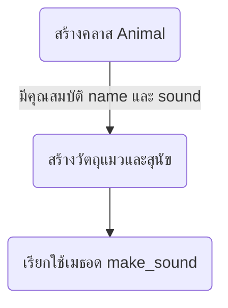
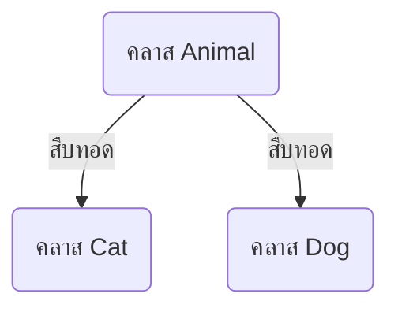
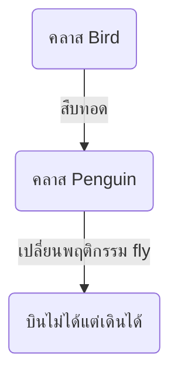
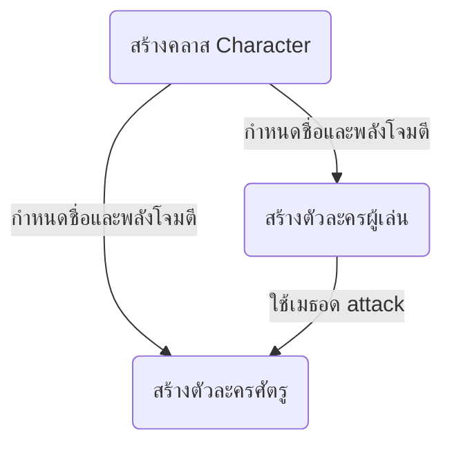

<!-- toc -->

# บทที่ 7: การเขียนโปรแกรมเชิงวัตถุ (Object-Oriented Programming - OOP)

## 1. แนวคิดของการเขียนโปรแกรมเชิงวัตถุ

การเขียนโปรแกรมเชิงวัตถุ (OOP) เป็นแนวคิดที่ใช้ **คลาส (Class)** และ **วัตถุ (Object)** เพื่อจัดกลุ่มข้อมูลและฟังก์ชันเข้าด้วยกัน ทำให้โค้ดเป็นระเบียบและนำกลับมาใช้ใหม่ได้ง่าย

### ตัวอย่างโค้ดการสร้างคลาสและวัตถุ

```python
class Animal:
    def __init__(self, name, sound):
        self.name = name
        self.sound = sound

    def make_sound(self):
        print(f"{self.name} ส่งเสียง {self.sound}")

# สร้างวัตถุ
cat = Animal("แมว", "เหมียว")
dog = Animal("สุนัข", "โฮ่ง")

cat.make_sound()
dog.make_sound()
```



## 2. Inheritance (การสืบทอดคุณสมบัติ)

**Inheritance** คือการที่คลาสหนึ่งสามารถสืบทอดคุณสมบัติและพฤติกรรมจากอีกคลาสหนึ่งได้

### ตัวอย่างโค้ด

```python
class Animal:
    def __init__(self, name):
        self.name = name

    def speak(self):
        pass  # ให้คลาสลูกกำหนดเอง

class Cat(Animal):
    def speak(self):
        return "เหมียว"

class Dog(Animal):
    def speak(self):
        return "โฮ่ง"

cat = Cat("แมว")
dog = Dog("สุนัข")

print(f"{cat.name} ส่งเสียง {cat.speak()}")
print(f"{dog.name} ส่งเสียง {dog.speak()}")
```



## 3. Polymorphism (พหุสัณฐาน)

**Polymorphism** ช่วยให้สามารถใช้เมธอดเดียวกันกับคลาสต่างๆ ได้ แม้ว่าจะทำงานต่างกัน

### ตัวอย่างโค้ด

```python
class Bird:
    def fly(self):
        return "บินได้"

class Penguin(Bird):
    def fly(self):
        return "บินไม่ได้ แต่เดินได้"

animals = [Bird(), Penguin()]
for animal in animals:
    print(animal.fly())
```



## 4. สร้างเกมง่ายๆ โดยใช้ OOP

### ตัวอย่าง: เกมตัวละครโจมตีศัตรู

```python
class Character:
    def __init__(self, name, attack_power):
        self.name = name
        self.attack_power = attack_power

    def attack(self, enemy):
        print(f"{self.name} โจมตี {enemy.name} ด้วยพลัง {self.attack_power}")

player = Character("ผู้เล่น", 10)
enemy = Character("ศัตรู", 5)

player.attack(enemy)
```



## **โจทย์ท้ายบท**

1. **สร้างคลาส `Car`** ที่มี `brand` และ `speed` และเมธอด `drive()` ที่พิมพ์ว่ารถวิ่งที่ความเร็วเท่าใด
2. **สร้างคลาส `Student`** ที่มี `name` และ `score` และเมธอด `show_info()` ที่แสดงข้อมูลนักเรียน
3. **สร้างคลาส `BankAccount`** ที่มี `balance` และเมธอด `deposit(amount)` และ `withdraw(amount)`
4. **สร้างเกมง่ายๆ** ที่มีคลาส `Player` และ `Enemy` โดยให้ `Player` สามารถโจมตี `Enemy`
5. **ใช้ Inheritance** สร้างคลาส `Rectangle` และ `Square` โดย `Square` สืบทอดจาก `Rectangle`
