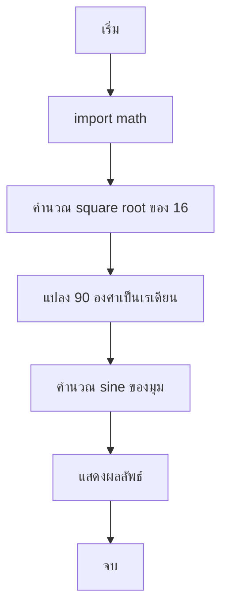
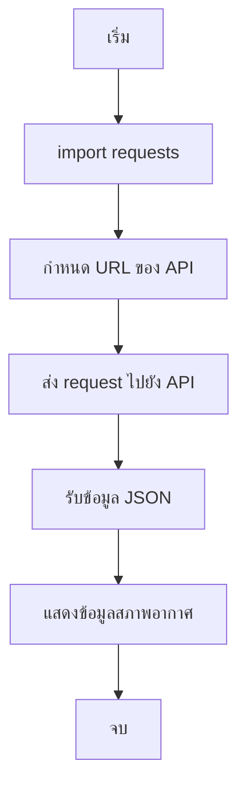

<!-- toc -->

# บทที่ 8: การใช้ไลบรารีและโมดูลใน Python

ในบทนี้เราจะเรียนรู้เกี่ยวกับการใช้ไลบรารีและโมดูลต่างๆ ใน Python ที่ช่วยให้เราทำงานได้ง่ายขึ้นและเร็วขึ้น เราจะเริ่มจากโมดูลพื้นฐานอย่าง `math` และไลบรารีอื่นๆ ที่น่าสนใจ เช่น `requests` ที่ใช้สำหรับดึงข้อมูลจากเว็บไซต์

## 1. การใช้โมดูล `math` สำหรับการคำนวณทางคณิตศาสตร์

โมดูล `math` เป็นโมดูลพื้นฐานที่ช่วยในการคำนวณทางคณิตศาสตร์ เช่น การหาค่า square root, ค่า sine, cosine, และอื่นๆ

### ตัวอย่างโค้ด

```python
import math

# คำนวณ square root ของ 16
result = math.sqrt(16)
print("Square root of 16 is:", result)

# คำนวณค่า sine ของ 90 องศา
angle = math.radians(90)  # แปลงองศาเป็นเรเดียน
sine_value = math.sin(angle)
print("Sine of 90 degrees is:", sine_value)
```



## 2. การใช้ไลบรารี `requests` สำหรับการดึงข้อมูลจากเว็บไซต์

ไลบรารี `requests` ช่วยให้เราสามารถดึงข้อมูลจากเว็บไซต์ได้ง่ายๆ เช่น การดึงข้อมูลสภาพอากาศจาก API

### ตัวอย่างโค้ด

```python
import requests

# URL ของ API สภาพอากาศ
url = "https://api.openweathermap.org/data/2.5/weather?q=Bangkok&appid=your_api_key"

# ส่ง request ไปยัง API
response = requests.get(url)

# แสดงข้อมูลสภาพอากาศ
data = response.json()
print("สภาพอากาศในกรุงเทพฯ:", data['weather'][0]['description'])
```



## **โจทย์ท้ายบท**

1. **คำนวณพื้นที่วงกลม**: ให้เขียนโปรแกรมที่รับค่ารัศมีของวงกลมและคำนวณพื้นที่วงกลมโดยใช้โมดูล `math`
2. **แปลงอุณหภูมิ**: ให้เขียนโปรแกรมที่แปลงอุณหภูมิจากเซลเซียสเป็นฟาเรนไฮต์โดยใช้สูตร `F = C * 9/5 + 32`
3. **ดึงข้อมูลประชากร**: ให้เขียนโปรแกรมที่ดึงข้อมูลประชากรของประเทศหนึ่งๆ จาก API และแสดงผล
4. **คำนวณค่าเฉลี่ย**: ให้เขียนโปรแกรมที่รับค่าตัวเลข 5 จำนวนและคำนวณค่าเฉลี่ย
5. **แสดงข้อมูลเวลา**: ให้เขียนโปรแกรมที่แสดงเวลาปัจจุบันโดยใช้โมดูล `datetime`
