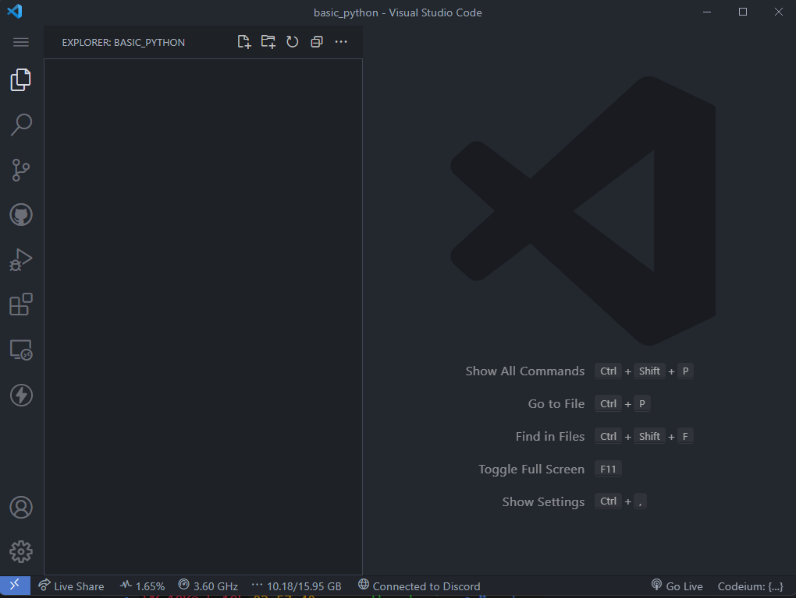
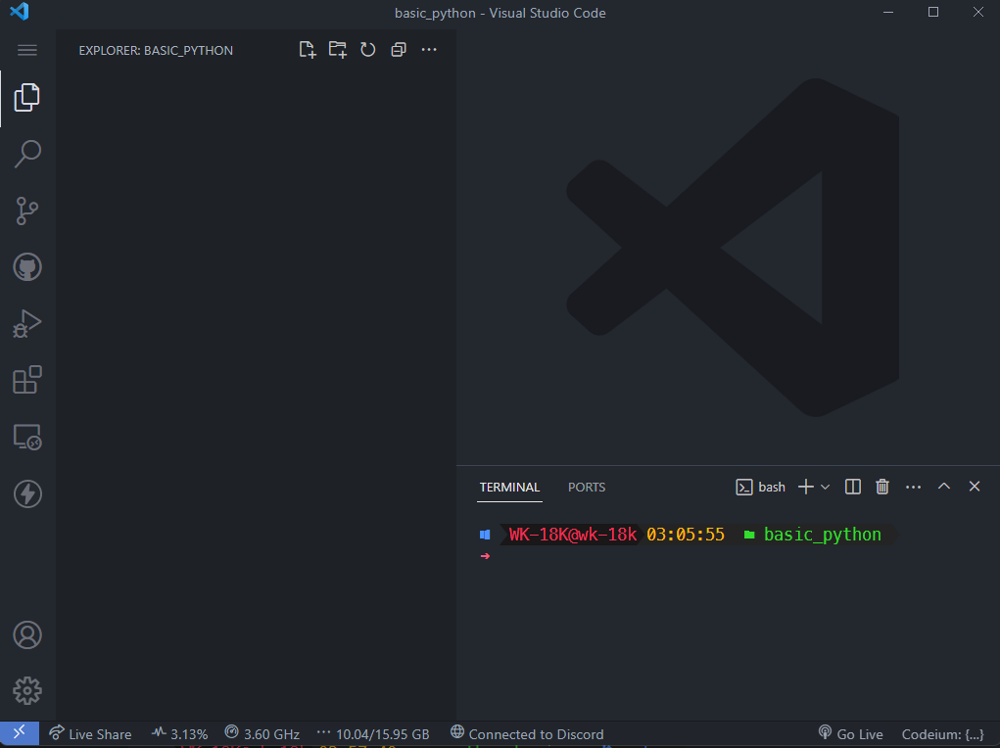
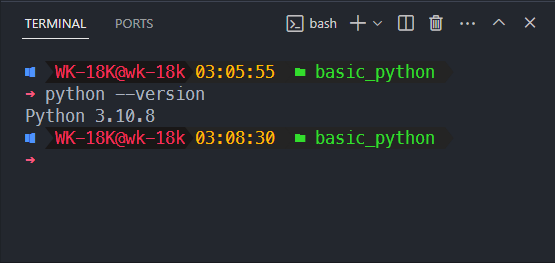
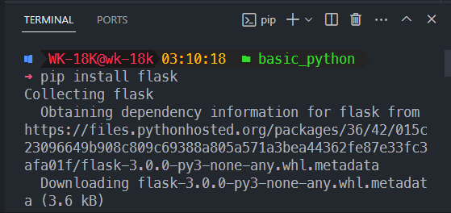

# Flask : การติดตั้ง Flask

ในบทนี้เราจะเริ่มต้นด้วยการติดตั้ง Flask เพื่อใช้ในการสร้างเว็บไซต์ของเรา

ก่อนอื่นทำการสร้างโฟลเดอร์ไว้เก็บโปรเจ็คกันก่อนจะเอาไว้ที่ไหนก็ได้จากนั้นเปิดมันแล้วใส่ไว้ในโปรแกรม `VSCode` ให้เรียบร้อย



จากนั้นเปิด `terminal` ขึ้นมาโดยกดปุ่ม `ctrl+j` หรือ `command+j`



การติดตั้ง Flask
ก่อนที่เราจะเริ่มต้นใช้งาน Flask เราจำเป็นต้องติดตั้ง Python ก่อน โดย Flask สามารถทำงานได้บน Python เวอร์ชัน 2.7 หรือ 3.5 หรือเวอร์ชันใหม่กว่า ดังนั้นเราควรตรวจสอบเวอร์ชันของ Python ที่เราใช้งานอยู่ก่อนที่จะติดตั้ง Flask โดยทำการเขียนที่ `terminal` ว่า

```sh
python --version
```

หรือ

```sh
python3 --version
```



เมื่อเราตรวจสอบและติดตั้ง Python เรียบร้อยแล้ว เราสามารถติดตั้ง Flask ได้โดยใช้คำสั่งต่อไปนี้ใน`terminal`:

```sh
pip install flask
```

หรือ

```bash
pip3 install flask
```



คำสั่งนี้จะดาวน์โหลดและติดตั้ง Flask และโมดูลที่เกี่ยวข้องที่จำเป็นสำหรับการทำงานของ Flask ในระบบของเรา

เมื่อการติดตั้งเสร็จสมบูรณ์ เราสามารถทดสอบการติดตั้ง Flask ได้โดยการเขียนโค้ดตัวอย่างง่ายๆโดยสร้างไฟล์ `app.py` ขึ้นมาแล้วเขียนตามโค้ดด้านล่าง:

```py
from flask import Flask

app = Flask(__name__)

@app.route('/')
def hello():
    return 'สวัสดี Flask!'

if __name__ == '__main__':
    app.run()
```

ในโค้ดนี้ เรากำหนดให้ Flask สร้างและเริ่มต้นแอปพลิเคชันของเรา และกำหนดให้เมื่อมีการเข้าถึง URL หลักของเว็บไซต์ เราจะส่งข้อความ "สวัสดี Flask!" กลับไป

เพื่อรันแอปพลิเคชัน Flask ของเรา เราสามารถใช้คำสั่งต่อไปนี้ใน`terminal`:

```sh
python app.py
```

หรือ

```sh
python3 app.py
```

เมื่อรันคำสั่งนี้ เราจะเห็นข้อความ "Running on http://127.0.0.1:5000" ใน `terminal` ซึ่งหมายถึงแอปพลิเคชันของเรากำลังทำงานบนเซิร์ฟเวอร์ที่พอร์ต 5000

เราสามารถเข้าถึงแอปพลิเคชันของเราได้โดยใช้ URL ในเว็บเบราว์เซอร์โดยไปที่ลิงก์ [http://127.0.0.1:5000](http://127.0.0.1:5000) หรือกดปุ่ม `ctrl+click` และเราจะเห็นข้อความ "สวัสดี Flask!" ที่แสดงอยู่บนหน้าเว็บ

ปล. ถ้าหากขึ้น `ModuleNotFoundError: No module named 'flask'` แสดงว่ายังไม่ได้ติดตั้ง Flask ให้ทำการติดตั้งก่อนค่อยรันอีกรอบ

นี่คือขั้นตอนการติดตั้ง Flask เพื่อเริ่มต้นการสร้างเว็บไซต์ของเรา ในบทถัดไป เราจะเริ่มสร้างโครงสร้างของเว็บไซต์และใช้งานเทมเพลตกัน

คุณสามารถอ่านเนื้อหาเพิ่มเติมเกี่ยวกับ Flask และคำสั่งที่ใช้ในการใช้งานได้ในเอกสารอ้างอิง Flask ที่อยู่ในเว็บไซต์ของ Flask ได้ที่นี่ (https://flask.palletsprojects.com/)[https://flask.palletsprojects.com/] แต่ถ้าขี้เกียจอ่านก็ค่อยทำตามทีละขั้นตอนแล้วกันนะ
