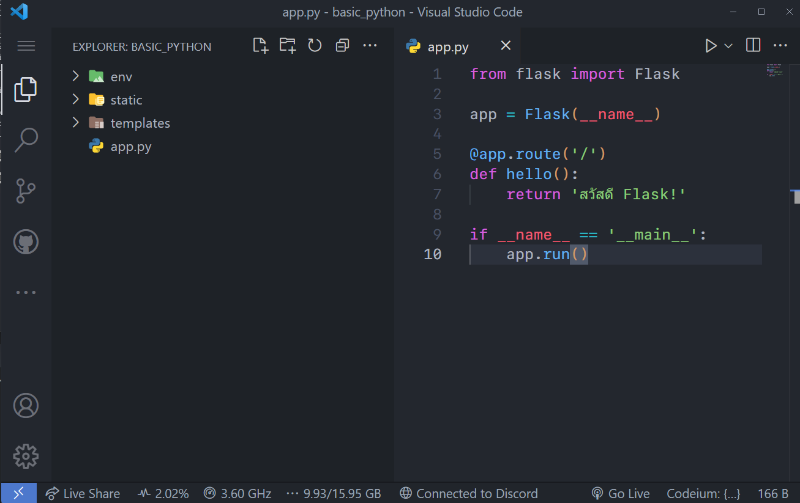

# การสร้างโครงสร้างของเว็บไซต์

ในส่วนนี้เราจะมาเรียนรู้เกี่ยวกับการสร้างโครงสร้างของเว็บไซต์ด้วย Flask กัน การสร้างโครงสร้างของเว็บไซต์เป็นขั้นตอนสำคัญที่จะช่วยให้เราสามารถพัฒนาเว็บไซต์ได้อย่างมีระบบและเป็นระเบียบ โดยเราจะมีการแบ่งโครงสร้างของเว็บไซต์ออกเป็นส่วนย่อยๆ ที่มีหน้าที่แตกต่างกัน ซึ่งจะทำให้เราสามารถจัดการและพัฒนาแต่ละส่วนได้อย่างมีประสิทธิภาพ

ภาพจาก [https://www.infidigit.com/wp-content/uploads/2019/11/website-structure-1.jpg](https://www.infidigit.com/wp-content/uploads/2019/11/website-structure-1.jpg)

## โครงสร้างพื้นฐานของ Flask

เมื่อเราเริ่มต้นสร้างเว็บไซต์ด้วย Flask เราจะต้องสร้างโครงสร้างพื้นฐานของโปรเจคก่อน โครงสร้างพื้นฐานนี้ประกอบด้วยไฟล์และโฟลเดอร์ต่างๆ ที่จำเป็นสำหรับการทำงานของเว็บไซต์ เราสามารถสร้างโครงสร้างพื้นฐานดังนี้:

`สร้างโฟลเดอร์สำหรับโปรเจค`:

- เริ่มต้นด้วยการสร้างโฟลเดอร์สำหรับเก็บไฟล์ของโปรเจค เช่น my_website ซึ่งเราสร้างไปแล้วนั้นเองก็คือโฟลเดอร์ที่เก็บไฟล์ `app.py` ไว้นั่นเอง

สร้างไฟล์ `app.py`:

- ไฟล์นี้จะเป็นจุดเริ่มต้นของการทำงานของเว็บไซต์ เราจะ `import Flask` และสร้าง instance ของ Flask ขึ้นมา เพื่อใช้ในการกำหนดเส้นทางและการทำงานของแต่ละหน้า

สร้างโฟลเดอร์ `templates`:

- เป็นโฟลเดอร์ที่ใช้เก็บไฟล์เทมเพลตของเว็บไซต์ เราสามารถสร้างไฟล์ HTML และใช้งานเทมเพลตใน Flask ได้ในโฟลเดอร์นี้

สร้างโฟลเดอร์ `static`:

- เป็นโฟลเดอร์ที่ใช้เก็บไฟล์สถิติ เช่น CSS, JavaScript, รูปภาพ เราสามารถเรียกใช้ไฟล์เหล่านี้ในเว็บไซต์ของเราได้

ลงมือสร้างได้เลยให้มีลักษณะดังภาพนี้:


ปล. โฟลเดอร์ `env` ในภาพไม่ต้องสร้างตามเพราะเป็น environment ใช้เป็นที่เก็บ package ที่ติดตั้งเช่น Flask สำหรับผู้เริ่มต้นไม่แนะนำแต่หากต้องการศึกษาเพิ่มเติมได้ที่ [https://docs.python.org/3/library/venv.html](https://docs.python.org/3/library/venv.html)

## การแบ่งโครงสร้างของเว็บไซต์

เมื่อเราได้สร้างโครงสร้างพื้นฐานของเว็บไซต์แล้ว เราสามารถแบ่งโครงสร้างของเว็บไซต์ออกเป็นส่วนย่อยๆ ที่มีหน้าที่แตกต่างกันได้ เพื่อให้ง่ายต่อการจัดการและพัฒนาเว็บไซต์ในอนาคต ตัวอย่างของโครงสร้างเว็บไซต์ที่เราสามารถแบ่งออกได้คือ:

ส่วนของหน้าแสดงข้อมูล: เป็นส่วนที่ใช้ในการแสดงข้อมูลต่างๆ ที่เราต้องการให้ผู้ใช้เห็น เช่น หน้าแสดงรายการสินค้า, หน้าแสดงรายละเอียดสินค้า เป็นต้น

ส่วนของรูปแบบ CSS: เป็นส่วนที่ใช้ในการกำหนดรูปแบบและสไตล์ของเว็บไซต์ เราสามารถใช้ CSS เพื่อปรับแต่งสีพื้นหลัง, ขนาดตัวอักษร, และการจัดวางขององค์ประกอบต่างๆ ในเว็บไซต์

ส่วนของการใช้งาน JavaScript: เป็นส่วนที่ใช้ในการเพิ่มความสามารถและประสิทธิภาพให้กับเว็บไซต์ เช่น การตรวจสอบข้อมูลก่อนส่งฟอร์ม, การแสดงผลแบบ Real-time เป็นต้น

เช่นในลักษณะแบบนี้:

```sh
├── app.py
├── static
│   ├── css
│   │   └── style.css
│   └── js
│       └── app.js
└── templates
    ├── index.html
    ├── product_list.html
    └── product_detail.html
```

ซึ่งยังไม่จำเป็นต้องสร้างแค่ให้เข้าใจในส่วนของการแบ่งโครงสร้างของเว็บไซต์ที่จะเกิดขึ้นในอนาคต
