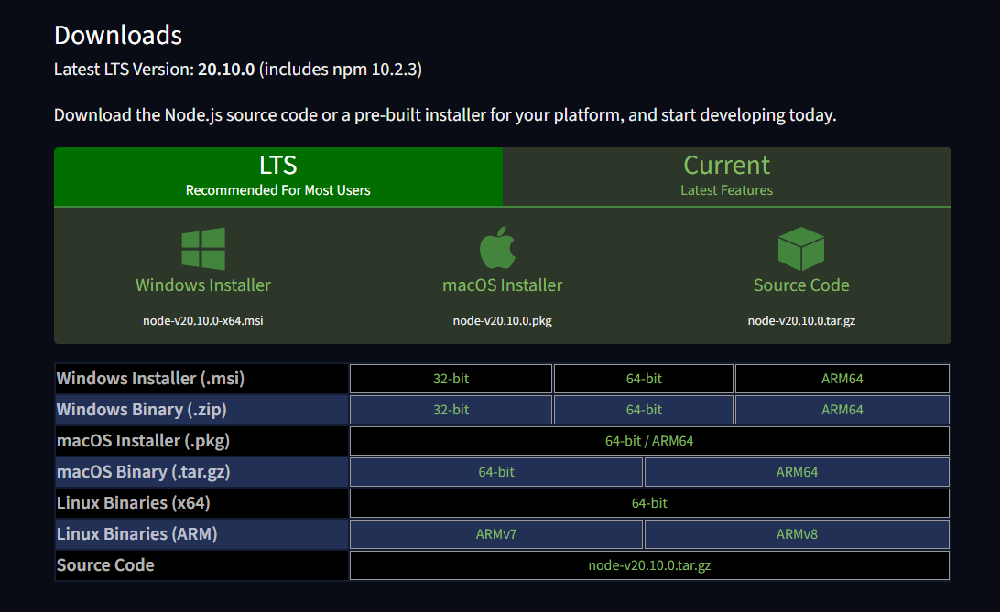

# สร้างโปรเจ็กต์ React ด้วย Vite

มีหลายวิธีในการสร้างโปรเจ็กต์ React แต่ขอแนะนำให้ใช้ Vite

Vite เป็นเครื่องมือที่ทันสมัยที่จัดเตรียมเซิร์ฟเวอร์สำหรับการพัฒนา มีความเร็วสูง และนักพัฒนา JS หลายคนต่างเห็นว่าเป็นตัวเลือกที่ดีที่สุด

💁‍♂️ หมายเหตุ: Vite สามารถใช้แทน `create-react-app ` ซึ่งเป็นเครื่องมือยอดนิยมอีกตัวหนึ่งแต่ช้ากว่า คุณสามารถใช้แทนกันได้หากต้องการ แต่พบว่า Vite นั้นยอดเยี่ยมมากและสามารถใช้กับไลบรารีอื่นๆ ได้ไม่ใช่แค่ React

ก่อนอื่นคุณจำเป็นต้องติดตั้ง Node JS เพื่อเป็นตัวพึ่งพาในการใช้งาน react คล้ายกับที่คุณติดตั้ง python นั่นเองโดยไปที่ [https://nodejs.org/en/download/](https://nodejs.org/en/download/) แล้วดาวน์โหลดเวอร์ชั่น LTS เพื่อความเสถียร์ได้เลย



จากนั้นในการสร้างโปรเจ็กต์โดยใช้ Vite ให้คุณเข้าไปที่โฟลเดอร์ที่คุณจะเก็บโปรเจ็กต์ทั้งหมดของคุณ ในกรณีจะขอใช้เป็นเป็นโฟลเดอร์ที่ชื่อว่า dev ในโฟลเดอร์หลักของผู้ใช้แล้วกัน หากคุณใช้ window คุณสามารถไปที่โฟลเดอร์เก็บโปรเจ็กต์แล้ว พิมพ์ `cmd` ตรงช่อง address ได้เลย


จากนั้นเรียกใช้คำสั่งต่อไปนี้

```bash
npm  create  vite@latest
```


เลือกชื่อสำหรับโปรเจ็กต์ นี่จะเป็นชื่อโฟลเดอร์ของโปรเจ็กต์ของคุณ ในกรณีนี้ขอใช้ชื่อเป็น `test` แล้วกัน


ตอนนี้คุณเลือกลูกศร ขึ้นลง เพื่อไปเลือก framework `React` จากนั้นกด `Enter`


เลือก JavaScript เพื่อความง่าย


เสร็จแล้ว!!


ตอนนี้ไปที่โฟลเดอร์โครงการที่สร้างขึ้นใหม่ ใช้คำสั่ง

```bash
cd test
```

จากนั้นเปิด `Vs Code` ด้วยคำสั่ง

```bash
code .
```

การเรียกใช้งานครั้งแรกจะติดตั้งสิ่งต่างๆในไฟล์ แต่ไม่ต้องห่วงเพียงแค่ใช้คำสั่งนี้

```bash
npm install
```

ทำการรันได้เลย!

```bash
npm run dev
```

เว็บแอปพลิเคชันควรจะทํางานที่ [http://localhost:5173](http://localhost:5173/) ( แต่บางทีพอร์ตอาจแตกต่างกันไป ) แต่คุณสามรถกด `ctrl` + `คลิกเมาส์ซ้าย` ที่ตัวลิงก์ที่โปรแกรมแสดงออกมาเพื่อเปิดได้


ก็จะได้แบบนี้มา


ตอนนี้คุณพร้อมที่จะทํางานกับแอปพลิเคชันนี้แล้ว!

นี่คือโฟลเดอร์แอปพลิเคชันที่เปิดใน `VS Code`

อย่างที่คุณเห็น Vite สร้างแอปพลิเคชันพื้นฐานให้คุณแล้วและตอนนี้คุณสามารถเปิดที่ไฟล์ `src/App.jsx` ได้เพื่อเริ่มลุยต่อ


ความสะดวกอย่างหนึ่งของเครื่องมืออย่าง Vite คือคุณสามารถเพิ่มไฟล์ได้ และ Vite จะจดจำไฟล์เหล่านั้นโดยอัตโนมัติ โดยไม่ต้องรีสตาร์ทแล้วรันใหม่ด้วย
`npm run dev` เหมือนที่เราเคยทำกับโปรเจ็กต์ Node.js

และเมื่อคุณบันทึกคอมโพเนนต์ คอมโพเนนต์นั้นจะได้รับการอัปเดตในเบราว์เซอร์ของคุณโดยอัตโนมัติ

ทำให้การพัฒนาเป็นไปอย่างรวดเร็วและสนุกสนาน!
