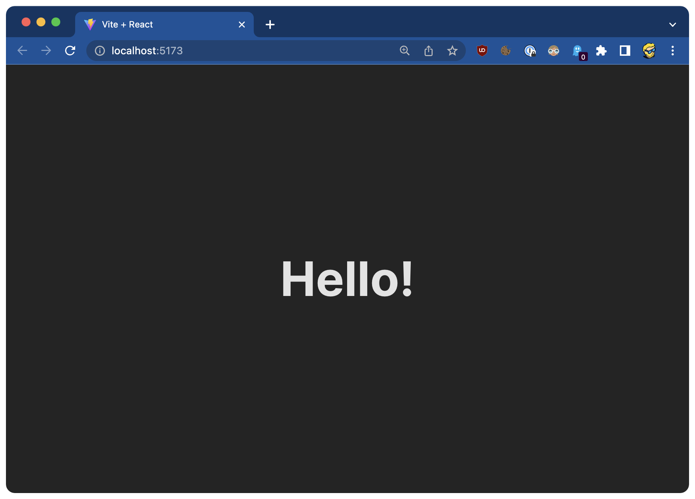
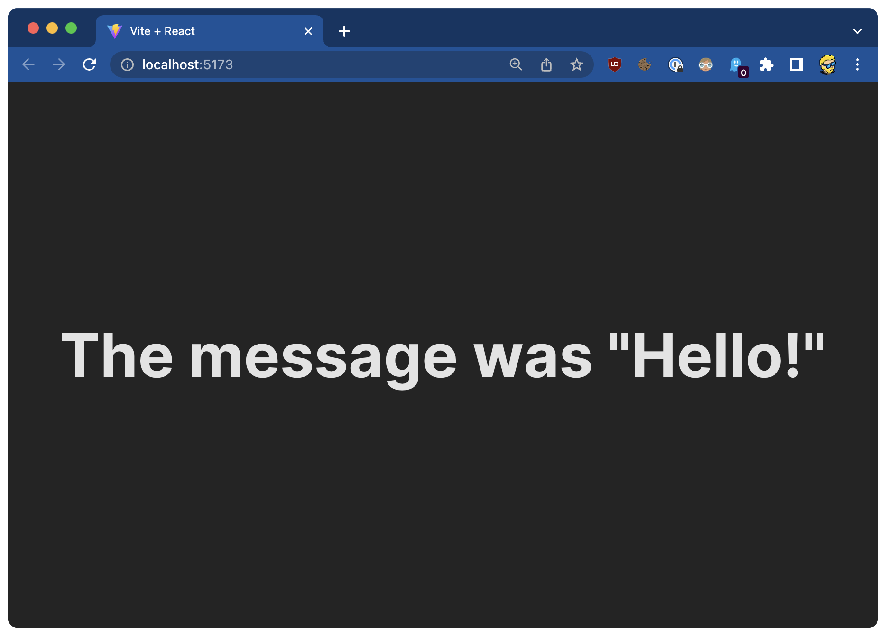

# การฝัง JavaScript ใน JSX

หนึ่งในคุณสมบัติที่ดีที่สุดของ React คือเราสามารถฝัง `JavaScript` ลงใน `JSX` ได้อย่างง่ายดายนั่นแหละนะ

เฟรมเวิร์กส่วนหน้า (Front-end) อื่นๆ เช่น `Angular` และ `Vue` มีวิธีเฉพาะของตนเองในการพิมพ์ค่า `JavaScript` ลงในเทมเพลตหรือดำเนินการต่างๆ เช่น วนซ้ำ

แต่ React ไม่ได้เพิ่มสิ่งใหม่อะไรเข้ามา แต่ว่าจะช่วยให้เราใช้ `JavaScript` ใน `JSX` แทนได้โดยใช้วงเล็บปีกกา `{ }`

ตัวอย่างแรกของสิ่งนี้ที่ จะแสดงให้คุณเห็นนั้นมาจาก Component App มาดูกันโดจตรงเลย

เรานำเข้าไฟล์โลโก้ SVG โดยใช้

```jsx
import reactLogo from "./assets/react.svg";
```

จากนั้นใน JSX เรากำหนดให้ไฟล์ SVG นี้เป็นกับค่าของแอตทริบิวต์ `src` ของแท็ก img:

```jsx

```

ลองอีกสักตัวอย่างนึง สมมติว่า Component App มีตัวแปรที่ชื่อว่า `message`

เราสามารถเอาค่าของตัวแปรนี้ออกมาแสดงใน JSX ได้โดยการเพิ่ม `{message}` ที่ใดก็ได้ใน `JSX`

```jsx
import "./App.css";

function App() {
  const message = "Hello!";

  return (
    <div className="App">
            <h1>{message}</h1>   {" "}
    </div>
  );
}

export default App;
```

แล้วลองรันดู! คุณน่าจะเห็นข้อความ Hello! ที่เป็นข้อมูลของ `message` อยู่บนเบราว์เซอร์



ภายในวงเล็บปีกกา `{ }` เราสามารถเพิ่มคำสั่ง `JavaScript` ใดๆลงไปได้หมด

ตัวอย่างเช่น นี่คือคำสั่งทั่วไปที่คุณจะพบใน `JSX `เราจะกำหนดเงื่อนไขแบบสั้นโดยจะตรวจสอบกรณีที่ (message === 'Hello!') และเราแสดงค่าหนึ่งออกมาหากเงื่อนไขเป็นจริง และแสดงค่าอื่นออกมาหากเงื่อนไขเป็นเท็จ:

```jsx
{
  message === "Hello!" ? 'The message was "Hello!"' : message;
}
```

แบบนี้:

```jsx
function App() {
  const message = "Hello!";

  return (
    <div className="App">
           {" "}
      <h1>{message === "Hello!" ? 'The message was "Hello!"' : message}</h1> 
       {" "}
    </div>
  );
}

export default App;
```

นี่คือผลลัพธ์:

หากคุณเปลี่ยนเนื้อหาของตัวแปร `message` จากนั้น `JSX` ก็จะแสดงค่าอย่างอื่น:

```jsx
function App() {
  const message = "Test";

  return (
    <div className="App">
           {" "}
      <h1>{message === "Hello!" ? 'The message was "Hello!"' : message}</h1> 
       {" "}
    </div>
  );
}

export default App;
```


