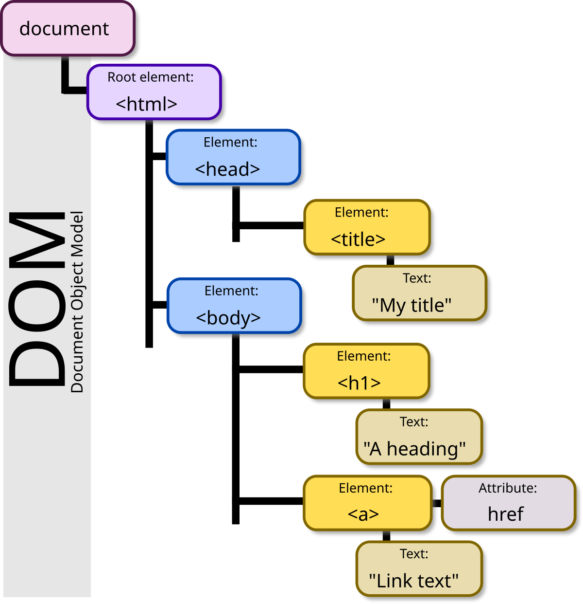

# React: การจัดการเหตุการณ์ (event) ของผู้ใช้

React มอบวิธีง่ายๆ ในการจัดการเหตุการณ์ที่เกิดจากเหตุการณ์ DOM (Document Object Model) เช่น การคลิก เหตุการณ์ในแบบฟอร์ม และอื่นๆ



เรามาพูดถึงเหตุการณ์การคลิกซึ่งค่อนข้างเข้าใจง่าย

คุณสามารถใช้แอตทริบิวต์ `onClick` กับองค์ประกอบ (element) `JSX` ใดก็ได้:

```jsx
<button
  onClick={(event) => {
    /* จัดการเหตุการณ์ */
  }}
>
  Click here
</button>
```

เมื่อคลิกองค์ประกอบ (element) ฟังก์ชันที่ส่งผ่านไปยังแอตทริบิวต์ `onClick` จะเริ่มทำงานทันที

คุณยังสามารถกำหนดฟังก์ชันในการจัดการหลังคลิกภายนอก `JSX` ได้:

```jsx
const handleClickEvent = (event) => {
  /* handle the event */
};

function App() {
  return <button onClick={handleClickEvent}>Click here</button>;
}
```

เมื่อเหตุการณ์คลิกเกิดขึ้นที่ปุ่ม โดย React จะเรียกใช้งานฟังก์ชัน `handleClickEvent`

React รองรับเหตุการณ์หลายประเภท เช่น `onKeyUp`, `onFocus`,`onChange`, `onMouseDown`, `onSubmit` และอื่นๆ อีกมากมาย
